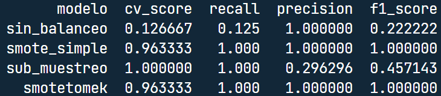

<!-- github doc -->
<!-- https://bit.ly/3IBkDvG -->

# Clasificación binaria con desbalance 

<!-- badges: start -->
<!--  -->

 

## Localización de fallas

<!--   -->

## Objetivo

> Se requiere identificar si una falla de fibra óptica ocurrió en la
> planta interna (1) o en la planta externa (0)

Se cuenta con un dataset con 4,661 observaciones, seis features y la
variable respuesta: interior.

## Data Dictionary

| variable   | class     | description                                              |
|:-----------|:----------|:---------------------------------------------------------|
| interior   | integer   | La falla ocurrió en el interior (1) o en el exterior (0) |
| ttr        | double    | Tiempo de reparación en horas                            |
| servicios  | integer   | Cantidad de servicios afectados en la falla              |
| materiales | double    | Cantidad de materiales utilizados                        |
| monto      | double    | Monto en dólares gastado en materiales                   |
| zona       | double    | Zona de Guatemala                                        |
| bu         | character | Unidad de negocio                                        |

### Desbalance

Los datos tienen un desbalance de $\frac{1}{125}$. De 4,621 ejemplos,
solo 40 observaciones pertenecen a la clase “interior”.

### Framework

Se utilizó “pipelines” para simplificar el análisis y evitar fugas ya
que el framework aplica automáticamente las mismas recetas (ej. feature
engineering, feature selection, etc) a los datos de validación y prueba.

### Estrategias de balanceo

1.  Sin balanceo
2.  SMOTE
3.  Sub-Muestreo
4.  SMOTE - [Tomek](https://bit.ly/3x2AMrc)

Aunque se probaron distintas combinaciones, como por ejemplo, dejando
los datos categóricos, hiperparámetros y distintos estimadores, por
simplicidad solo se establecieron cuatro recetas básicas que cumplen el
objetivo de evaluar el impacto del muestreo sintético sobre las
métricas.

### Estimadores

Se utilizó un esquema de ensemble para consolidar la mejor estimación de
tres modelos posibles: XGBoost, Regresión Logística y Random Forest. Se
creó una cuadrícula con hiperparámetros para cada caso.

### Conclusiones

Se realizó cross-validación con 10 folds y 5 repeticiones para cada
fold, obteniendo los siguientes resultados:

  

El mejor modelo fue *SMOTE* con una precisión y recall del 100%.
